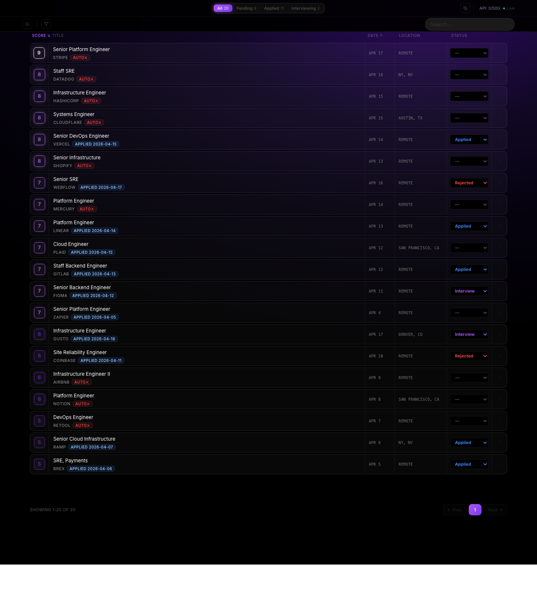
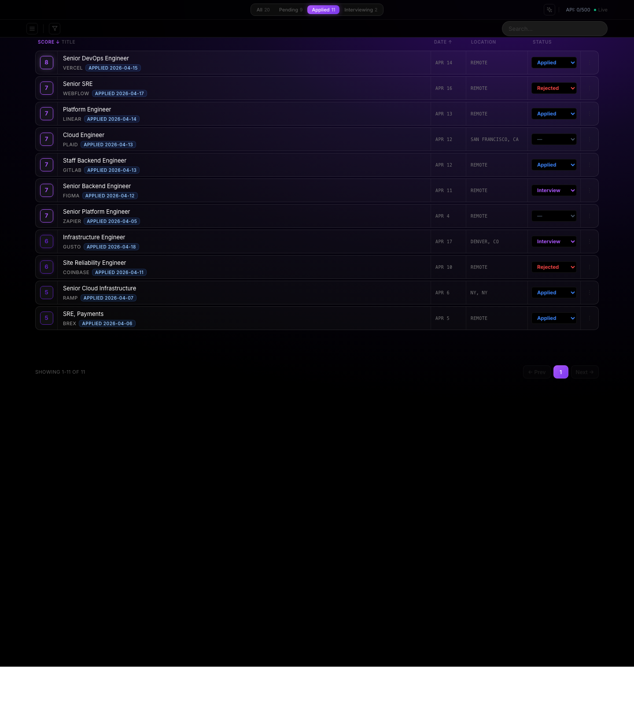
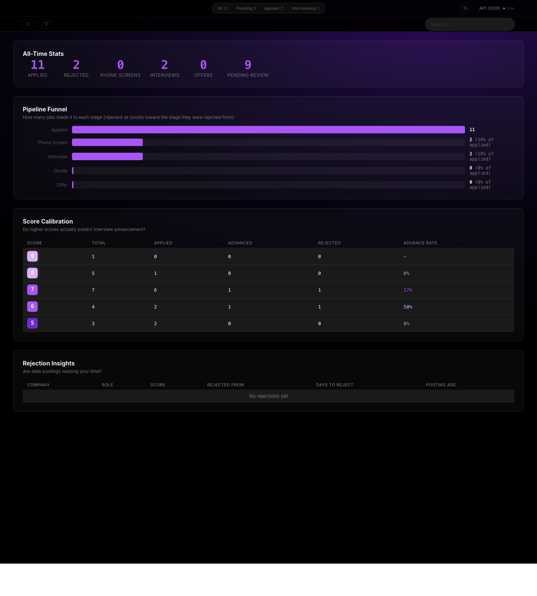
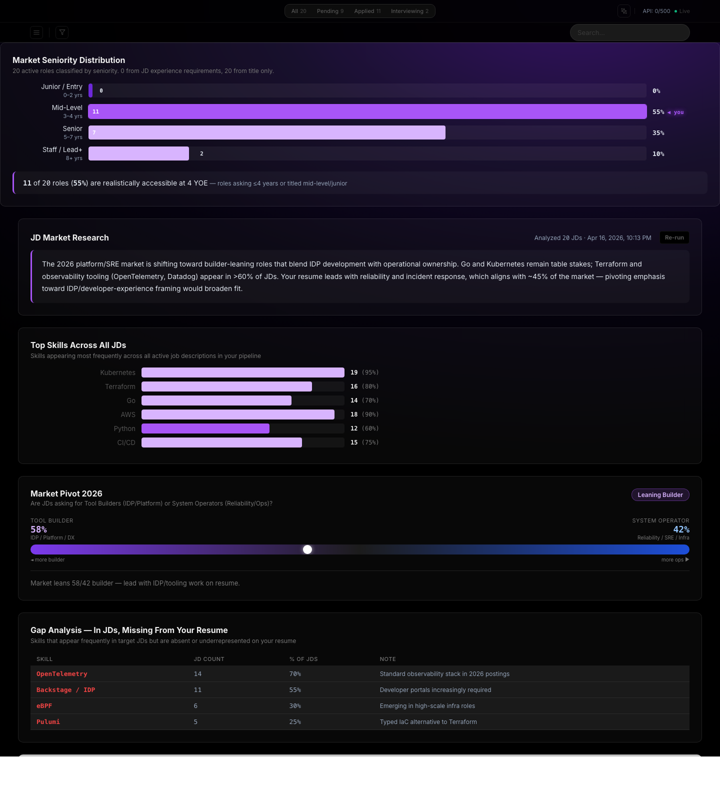
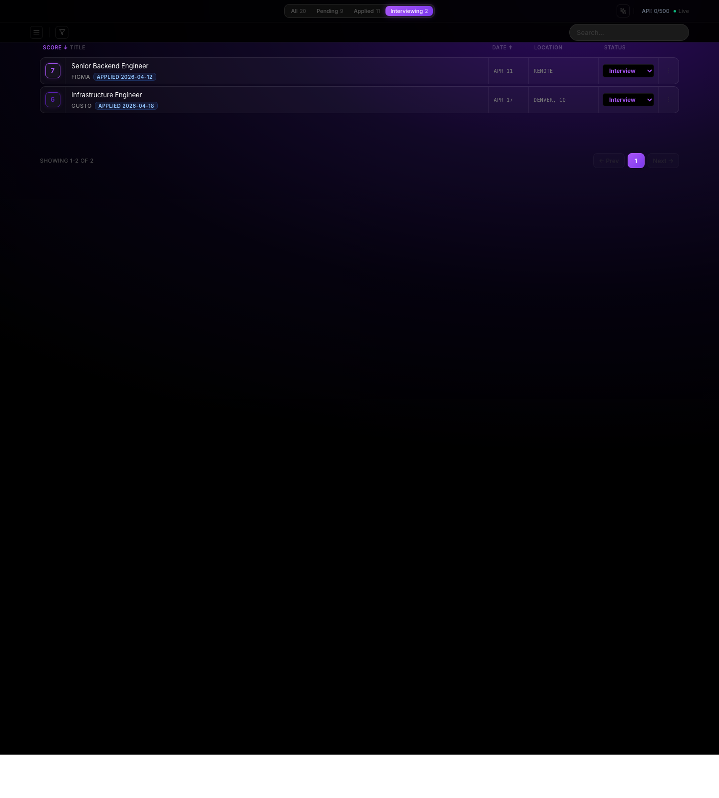
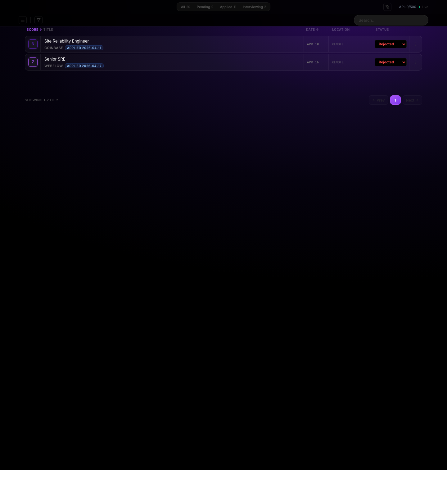

# Job Search Pipeline

An end-to-end automation pipeline for a technical job search. Scrapes 11 ATS platforms, scores each listing with an LLM against your resume and context files, generates manual application prep and tailored resumes, and serves a local dashboard for human review and pipeline tracking. IMAP integration syncs rejection emails back into the DB automatically.

Designed for a single applicant (or a small group sharing one machine), not as a SaaS. The point is to get the benefits of a structured pipeline without spinning up infrastructure for it.

## Screenshots

### Dashboard — scored, ranked, filterable job listings


### Applied pipeline — track stage progression


### Analytics — pipeline funnel + score calibration


### Market Research — LLM gap analysis against your resume


### Interviewing, rejected, and activity log views
<p float="left">
  
  
  
</p>


## Architecture

```
                       +----------------+
  cron / launchd  ---> |  run-daily.sh  |
                       +----------------+
                               |
               +---------------+---------------+
               v                               v
      +-----------------+            +-----------------+
      |   scraper.js    |            |  per-profile    |
      | (11 platforms)  |            |  run            |
      +--------+--------+            +--------+--------+
               |                              |
               v                              v
        jobs.json (tmp)                pipeline.js
                                              |
                              +---------------+-------------------+
                              v               v                   v
                      dedupe & insert    scorer.js         classifyComplexity
                      into SQLite        (Gemini)          (simple vs complex)
                              |               |                   |
                              +---------------+-------------------+
                                              |
                                              v
                                   +----------------------+
                                   |      jobs.db         |
                                   |  (per-profile)       |
                                   +----------+-----------+
                                              |
                                              v
                                   +----------------------+
                                   |    dashboard.js      |  <---- you (localhost)
                                   | (server-rendered)    |
                                   +----------+-----------+
                                              |
                           +------------------+--------------------+
                           v                                       v
                 +------------------+                 +---------------------+
                 | tailored-resume  |                 | application-prep    |
                 | (per-job MD /    |                 | (manual answers,    |
                 |  HTML / PDF)     |                 |  bookmarklet, JSON) |
                 |                  |                 |                     |
                 +------------------+                 +---------------------+
                           |                                       |
                           +-----------------+---------------------+
                                             |
                                             v
                                  +----------------------+
                                  |   rejection email    |
                                  |   sync via IMAP      |
                                  +----------------------+
```

## Tech stack

- **Node.js 18+** (CommonJS), zero build step
- **better-sqlite3** for per-profile job storage
- **puppeteer-core + puppeteer-extra-plugin-stealth** for ATS inspection and resume PDF rendering
- **Google Gemini Flash** for scoring, complexity classification, application prep, and tailored resumes
- **imapflow** for inbox rejection sync
- **Server-rendered HTML** dashboard with vanilla client-side JS

## Features

### Multi-source scraping

Pulls from Greenhouse, Lever, Ashby, Workable, Workday, Wellfound, Built In, Rippling, RemoteOK, Jobicy, Arbeitnow, and WeWorkRemotely. Company slugs configured per profile, global boards filtered by search terms. Respectful rate limits and User-Agent.

### LLM scoring with post-processing

Gemini scores each job 1-10 along five dimensions (stack match, seniority, comp, company stage, desirability). Scores are post-processed deterministically to cap mis-rated roles (for example, roles requiring 8+ YOE cap at 3 regardless of prompt output).

### Application complexity classifier

Each scored job is tagged `simple` or `complex` so you can triage apply effort. The active workflow is manual: generate prep, generate a tailored resume, open the job URL, review everything, and submit yourself.

### Tailored resumes

For any job, generate a job-specific resume from the active profile's `resume.md`, optional resume variants, `context.md`, and `career-detail.md`. Artifacts are stored under `JOB_PROFILE_DIR/tailored-resumes/<job-id>/` as Markdown, HTML, PDF, and metadata JSON.

### Voice-aware LLM drafting

All answers generated for applications pass through a voice check (`lib/voice-check.js`) that flags em dashes, corporate buzzwords, and AI-flavored sentence structure. Flagged answers can be rewritten by the LLM with the issues highlighted.

### Dashboard

Server-rendered HTML (no framework, no build step) on `localhost:3131`. Filter tabs, pipeline tracking (Applied → Phone Screen → Interview → Onsite → Offer / Rejected), market research analytics, company notes, and interview prep notes attached to each job.

### Rejection email sync

Every 5 minutes, the dashboard IMAPs your Gmail, pattern-matches rejection emails against known applied jobs, and flips their stage to `rejected` with the rejection reason parsed out.

### Multi-profile support

Multiple applicants on one machine (a couple, say) run isolated pipelines by pointing `JOB_PROFILE_DIR` and `JOB_DB_PATH` at different directories. `run-daily.sh` loops through all profiles automatically.

## Design decisions

A few things worth flagging:

- **No framework, no build step.** The dashboard is server-rendered HTML with a single CSS file. This is a personal tool, not a product. Adding Next.js buys nothing.
- **SQLite over any server DB.** The pipeline runs on one machine. A single-file DB is zero-config, backs up with `cp`, and handles the workload trivially.
- **File-based context over vector DB.** LLM calls read `resume.md`, `context.md`, and `career-detail.md` directly. A vector DB would add complexity for a corpus that fits in a prompt.
- **Env-var profile isolation.** `JOB_PROFILE_DIR` and `JOB_DB_PATH` keep profiles apart. No code branching, no per-profile if-statements.
- **Events table for audit trail.** Every pipeline state change is logged, which makes rejection analysis (days-to-rejection, posting age on apply) tractable.

More detail in `.context.example/decisions/`.

## Setup

```bash
git clone https://github.com/jakemercure28/job-search-automation.git
cd job-search-automation

# 1. Dependencies (Node 18+ required, see `.nvmrc` if using nvm)
npm install

# 2. Config
cp .env.example .env
# then fill in:
#   - GEMINI_API_KEY (https://aistudio.google.com/apikey)
#   - APPLICANT_* fields for your identity
#   - GMAIL_EMAIL / GMAIL_APP_PASSWORD (optional; for rejection sync)

# 3. Profile scaffolding
cp -r profiles/example profiles/your-name
# edit profiles/your-name/resume.md, context.md, career-detail.md, companies.js

# 4. Context scaffolding (for LLM grounding)
cp -r .context.example .context
# edit .context/people/applicant.md, voice.md as appropriate

# 5. Point .env at your profile (update these two lines in .env;
#    do not add a second copy, the last occurrence wins under `set -a`):
#   JOB_PROFILE_DIR=profiles/your-name
#   JOB_DB_PATH=profiles/your-name/jobs.db

# 6. First run
npm run daily
npm start            # dashboard on http://localhost:3131
```

### Try it with demo data (no API key required)

If you just want to see the dashboard populated without scraping or scoring:

```bash
cp .env.example .env
cp -r profiles/example profiles/demo
# set JOB_PROFILE_DIR=profiles/demo and JOB_DB_PATH=profiles/demo/jobs.db in .env
node scripts/seed-demo.js
npm start
# open http://localhost:3131
```

The seed script populates 20 fake jobs, pipeline stages, and a pre-computed market-research snapshot so every view in the screenshots above renders end-to-end.

## Common commands

```bash
npm run daily              # full pipeline: scrape → pipeline → retry
npm run scrape             # scrape only
npm run pipeline           # pipeline only (uses current jobs.json)
npm run score              # rescore unscored jobs
npm run retry-unscored     # retry jobs that failed scoring
npm run sync-rejections    # manual one-shot of rejection email sync
npm run apply -- list      # list scored jobs for manual application work
npm run apply -- prep --job=<id>
npm run apply -- resume --job=<id>
npm run apply -- show --job=<id>
npm run resume             # regenerate resume.pdf from resume.md
npm run build:bookmarklet  # build the auto-fill bookmarklet from your env
npm test                   # run the node test suite
```

## Scheduling

### Refresh pipeline (recommended)

`scripts/refresh-if-dashboard.sh` runs the full pipeline — scrape → score → check descriptions → check closed jobs → market research → rejection email sync — but only when the dashboard is already running on its port. Safe to fire frequently; it skips silently when you're not using the dashboard.

Add to crontab (`crontab -e`):

```
*/30 * * * * /path/to/job-search/scripts/refresh-if-dashboard.sh
```

Output is appended to `logs/refresh/YYYYMMDD.log` (created automatically).

### Daily scrape (optional, runs regardless of dashboard)

If you want a guaranteed morning scrape even when the dashboard is closed:

```
7 8 * * *   cd /path/to/job-search && bash scripts/run-daily.sh >> /tmp/job-search.log 2>&1
```

### macOS: keep the dashboard alive across reboots

Create a launchd LaunchAgent pointing at `scripts/start-dashboard.sh` with `KeepAlive` enabled. The dashboard will start on login and restart if it crashes, making the cron guard above useful 24/7.

## Extending

**New ATS platform:** add a `scrapers/<name>.js` module that exports `scrape<Name>()` and returns an array of job objects matching the schema in existing scrapers. Wire it into `scraper.js`.

**New filter tab:** add to `FILTER_DEFS` in `lib/html/helpers.js`, add a corresponding query in `filterQueries` in `lib/dashboard-routes.js`.

**Assisted apply internals:** `lib/ats-appliers/*` and `lib/auto-applier.js` are preserved as dormant infrastructure for future reviewed or semi-automatic workflows. They are not part of the active daily pipeline or dashboard actions.

**Scoring calibration:** edit the prompt in `scorer.js`. Deterministic caps live in `scoreJob()`; use those for "never over-score this pattern" rules the LLM keeps rationalizing past.

## Disclaimer

This is a personal project. Scrapers hit public job-board endpoints and respect typical rate-limit and User-Agent conventions. Before running at scale, review each site's Terms of Service. The active workflow keeps final application submission under human control.

Use responsibly. Not a guarantee of interviews, offers, or anything else.
